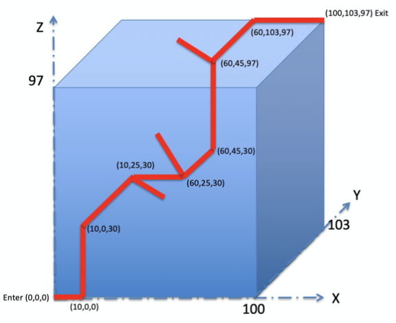
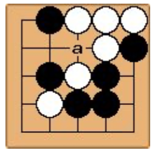
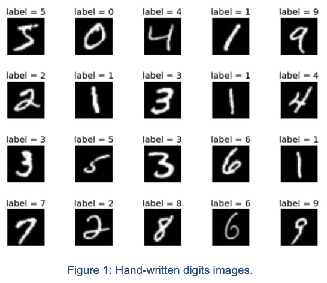

# USC CSCI-561 Fall 2020
All coursework for CSCI-561 Foundatios of Artificial Intelligence for the semester of Fall 2020 at USC.

## Homework 1
Path-Finding Algorithms (BFS, DFS, A\*) in a 3D maze  

 
For this assignment we applied AI search techniques to solve sophisticated 3D mazes.
Each 3D maze is a grid of points with (x,y,z) locations, there are 18 actions our agent can make (see assignment pdf for more details). The program should output the **optimal** path (according to the search algorithm).

## Homework 2
Little-GO agent on a 5x5 GO board  

 
This assignment was open-ended and allowed us to use any AI search, game playing, or reinforcement learning technique we desired. I decided to implement a simple minimax algorithm.
   
**Note:** If you are short on time, use the minimax algorithm as it will win *most* games. However, for full credit, you need to implement a more sophisticated solution. Using a Q-Learning approach is very heavy and not advised. Instead, I would opt for a more lightweight solution.

## Homework 3
MLP From scratch  

 
This was the easiest homework assignment, in my opinion. The only caveat is that you have to finish training **and** testing in **30 minutes**.
   
The easiest way to ensure this is to make sure you are using mini-batches for your forward and backward passes. If you understand the math, its a pretty simple jump to just use matrices instead of single datapoints.
I used a very simple model and got satisfactory results, I didn't have to implement Adam, use Dropout, Batch Normalization, etc.
